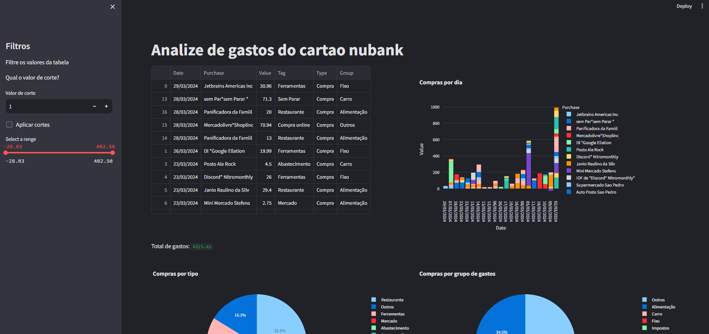

# Analizador de gastos conta Nubank
Este projeto tem como objetivo analisar os gastos de uma conta Nubank e gerar um relatório com os gastos por categoria.

## Como usar
### Instale as dependências
1. Instale o Python 3
2. Instale as dependências com o comando `pip install -r requirements.txt`
 
### Colete os dados
1. Va até o site do Nubank, no resumo da sua fatura (https://app.nubank.com.br/beta/credit-card/bills/bill-summary/)
2. Selecione o mes que deseja analisar
3. Salve a página em formato HTML (Ctrl + S) na pasta data com o nome padrao dele (```Resumo de faturas _ Nubank Web App.html```)

### Execute o script
1. Execute o script com o comando `python runner.py`
2. O script irá gerar um arquivo `report.csv` com os gastos por categoria
3. Abra o navegador e acesse o endereço `http://localhost:8502/` para visualizar os graficos